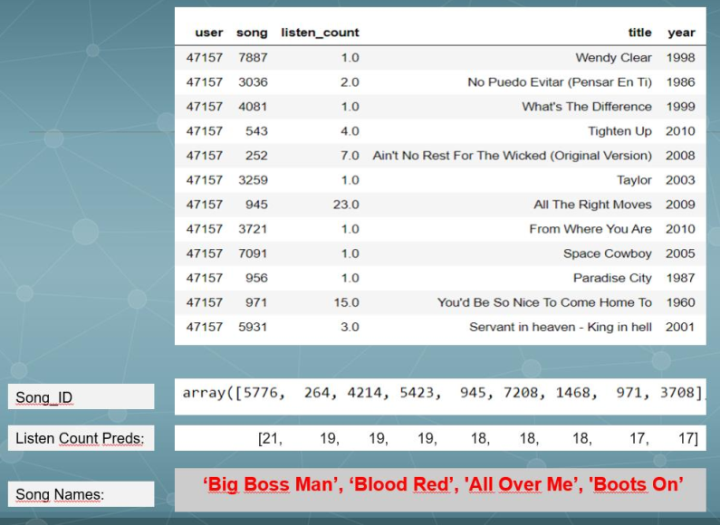
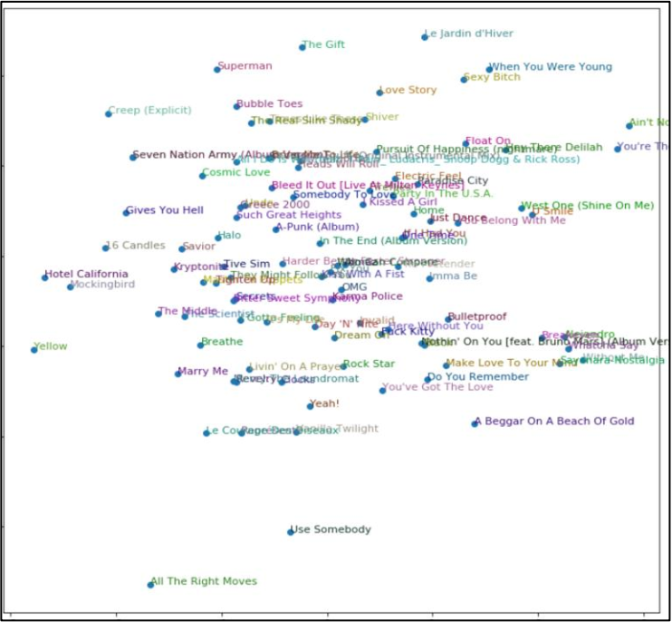

# “The Quest”

### Deep Learning Based Song Recommendation System

### 20/11/2020

The Quest is a deep learning-based music recommendation system. Suggestions were made with Deep Learning models instead of "Collaborative Filtering" which is one of the traditional methods. Models were developed using the Million Song data set for the project. It provides the user with suggestions about the number of times the user has listened to the music he has listened to before, or the music that is likely to listen among the music he has never heard before, and how many times he can listen.

Basically, our deep learning-based song recommendation system tries to understand the songs that the user likes, based on the songs that the user listens. In this way, it recommends the songs that the user does not listen to before but maybe can listen to many times in the future.

Below we will suggest new songs for user number 47157. We will also try to guess how many times user 47157 can listen to these songs. The main picture is the songs that 47157users have listened to before. The parts below are the IDs of the songs that our model predicts and the estimation of how many times these songs will be listened to by that user.

In this picture, the songs in the data set are close to each other according to their bias values.

By the way, the name of the project (The Quest) is the name of the most popular song (the song with the highest bias) in the data set. And we liked this song very much and we decided to make it the name of the project and the group :)
